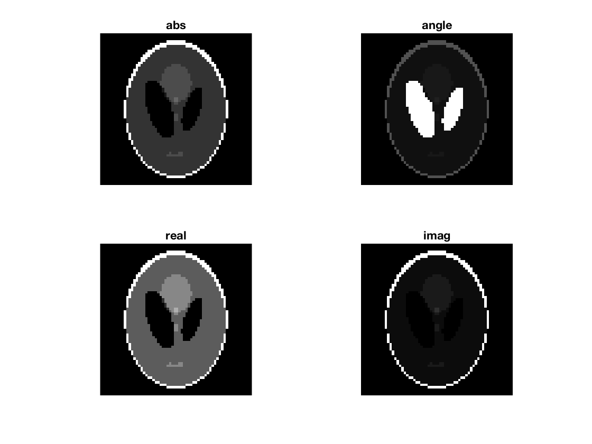
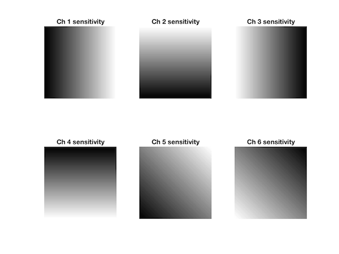
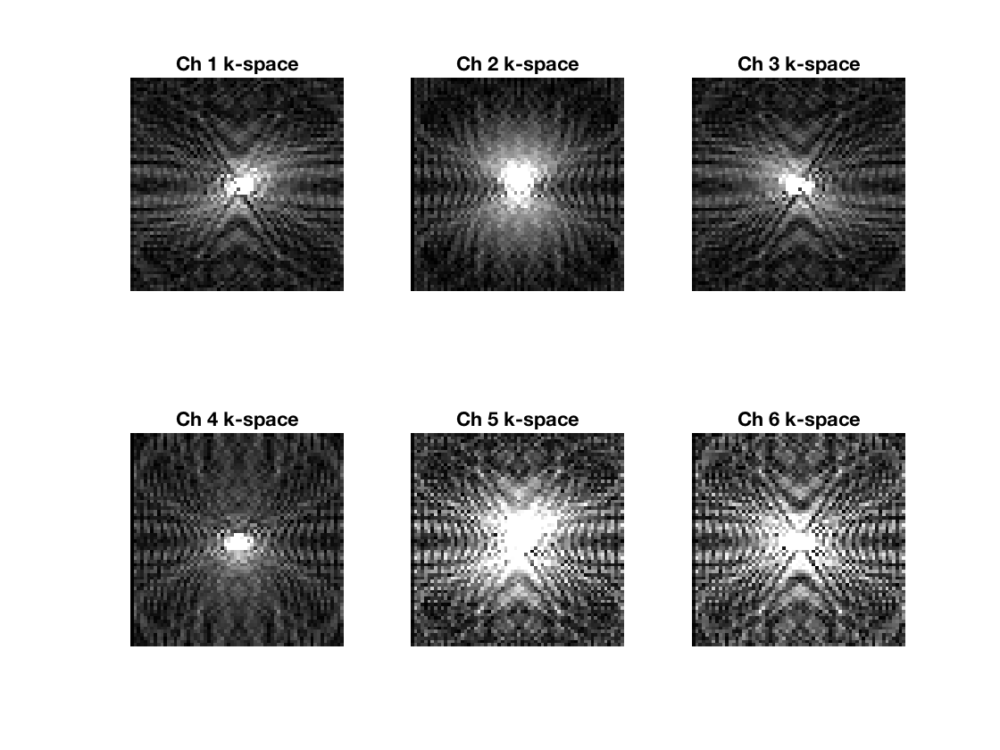
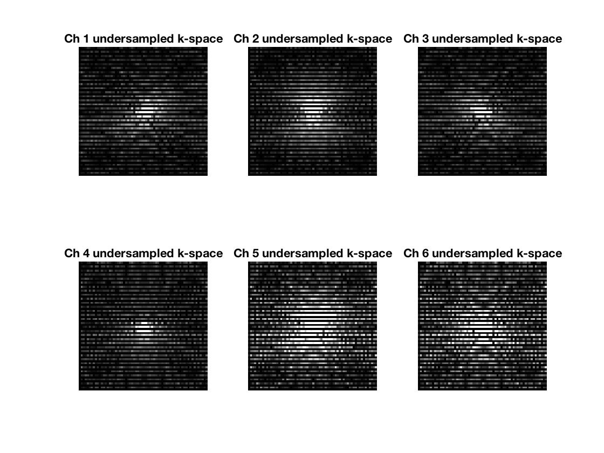
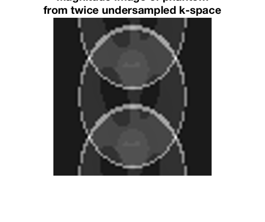
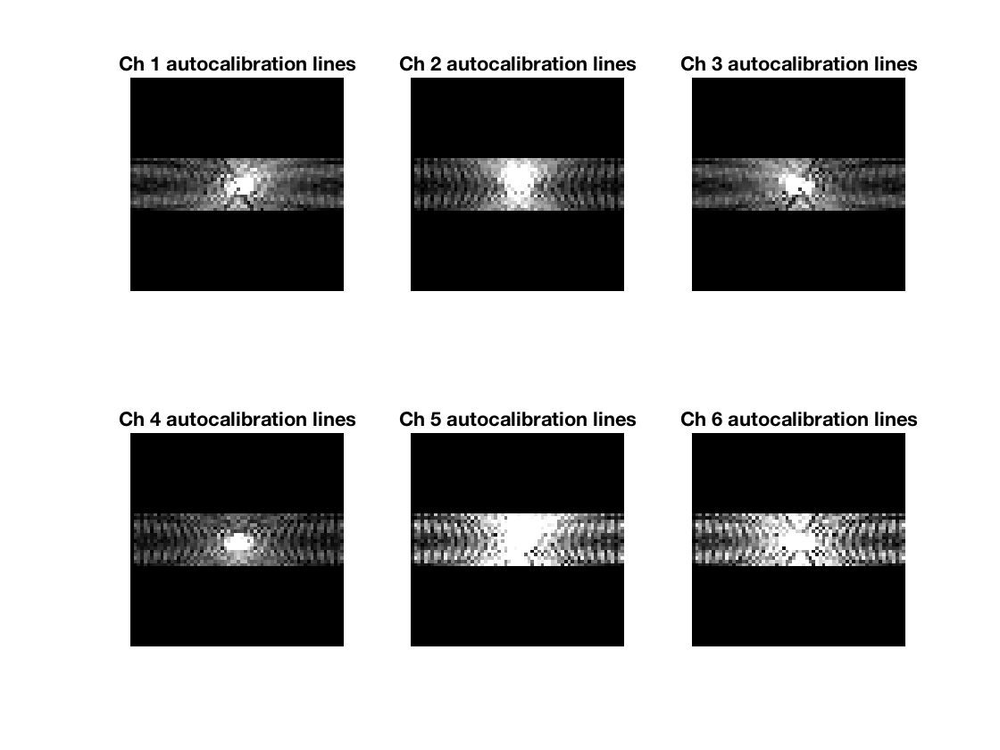
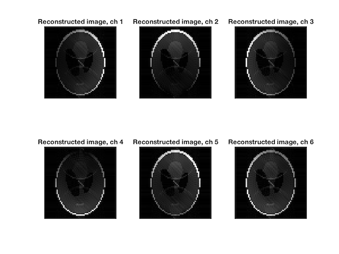
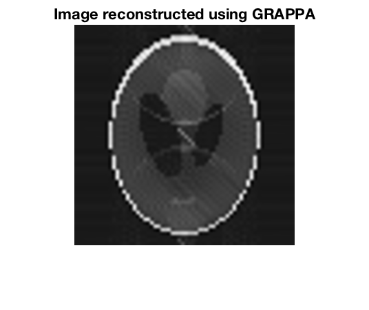

# Tutorial-MRI-Reconstruction-Using-GRAPPA
I wrote this code when trying to understand how GRAPPA reconstruction works. I was trying to keep it very simple and readable. Thought, it might be useful for someone else. Let me know if you have questions, comments, or suggestions: tetiana.d@gmail.com

Code consists of the following parts:

1. Load Shepp-Logan phantom.

2. Create six artificial sensitivities of the channels of the coil. This is done by creating linear intensity gradients in 6 directions. Adding more channels will improve the reconstruction.

3. Fourier transform each channel image to k-space

and undersample it twice.

Reconstruct the Shepp-Logan phantom image from the under sampled k-space to show the artifact.

4. Choose auto calibration lines.

5. Source (S) pixels are related to target (T) pixels by weighs (W): S * W = T. To find weights: W = inv(S) * T. (See schematic figure here: http://mriquestions.com/grappaarc.html)

6. Forward problem to find missing lines. T_unknown = S_undersampled * W

7. Fill in the missing lines into undersampled image.

Reconstruct image for each channel.

And finally reconstruct the image.

